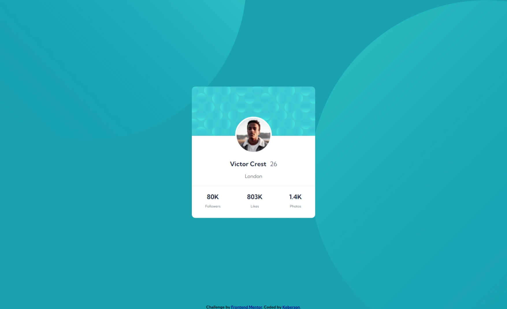
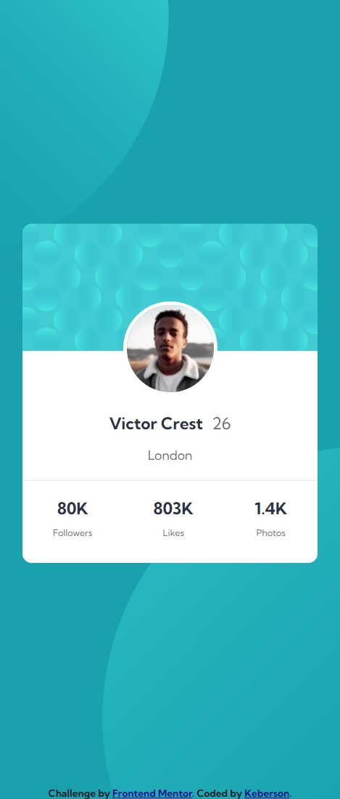

# Frontend Mentor - Profile card component solution

This is a solution to the [Profile card component challenge on Frontend Mentor](https://www.frontendmentor.io/challenges/profile-card-component-cfArpWshJ). Frontend Mentor challenges help you improve your coding skills by building realistic projects. 

## Table of contents

- [Overview](#overview)
  - [The challenge](#the-challenge)
  - [Screenshot](#screenshot)
  - [Links](#links)
- [My process](#my-process)
  - [Built with](#built-with)
- [Author](#author)
## Overview

### The challenge

- Build out the project to the designs provided

### Screenshot

Desktop (1440px) version:

Mobile (375px) version:

### Links

- Live Site URL: [GitHub](https://keberson.github.io/profile-card-component-main/)

## My process

### Built with

- Semantic HTML5 markup
- CSS custom properties
- Flexbox
- Mobile-first workflow
- Media queries

## Author

- Frontend Mentor - [@Keberson](https://www.frontendmentor.io/profile/Keberson)
- Twitter - [@Keberson](https://www.t.me/Keberson)